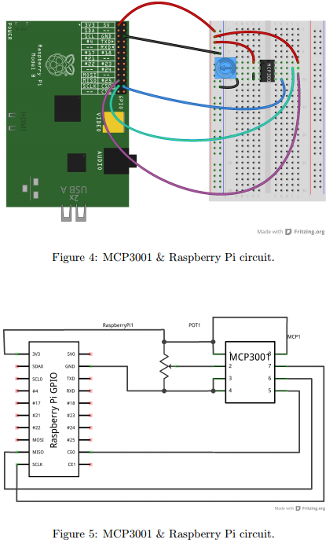
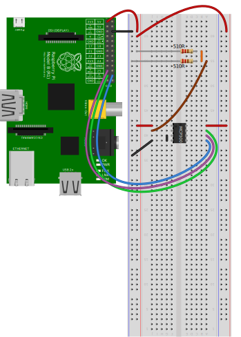
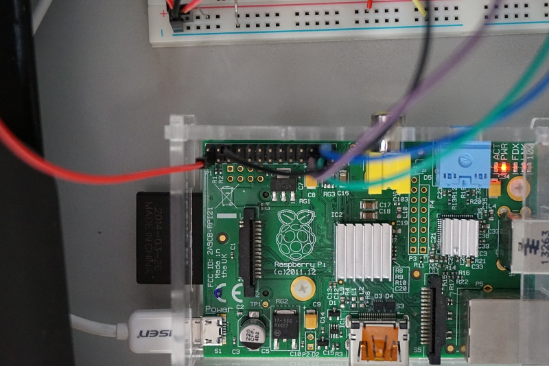
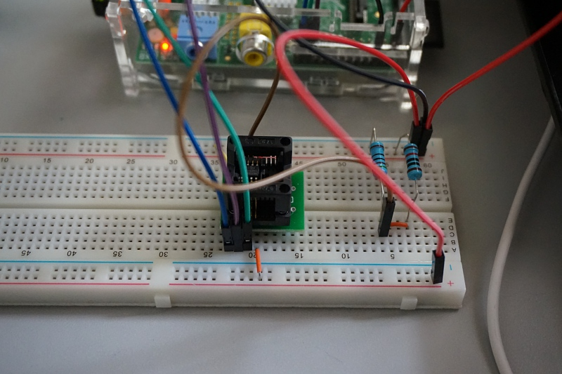
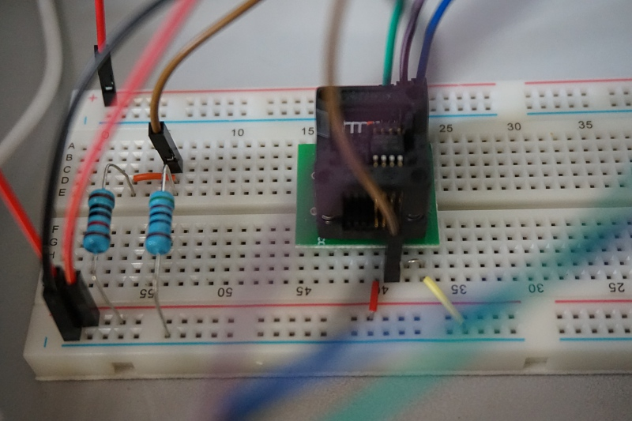

# Simple SPI on Raspberry Pi

[TOC]

## 参考

http://www.100randomtasks.com/simple-spi-on-raspberry-pi

http://www.raspberrypi.org/documentation/hardware/raspberrypi/spi/README.md

https://github.com/doceme/py-spidev

https://stackoverflow.com/questions/25679367/proxychains-unable-to-locate-file-on-kali-linux

http://troydenton.ca/rpi/labmanual.pdf

## 设备

* [MCP3001-I/SN SOP8][MCPlink]
* ~~[TLC1549CDR SOP][TLClink]~~

## 记录

### 配置proxychains

配置proxychains，使用主机的shadowsocks

```
sudo apt-get install proxychains
mkdir ~/.proxychains
sudo ln -s /usr/lib/proxychains3/proxyresolv /usr/bin/
nano ~/.proxychains/proxychains.conf
```

编辑

```
strict_chain
proxy_dns
[ProxyList]
socks5 192.168.137.1 1081
```

```
sudo nano /etc/proxychains.conf
```

编辑

```
strict_chain
proxy_dns
[ProxyList]
socks5 192.168.137.1 1081
```

### 加载SPI驱动

升级固件

`sudo proxychains rpi-update`

重启

`sudo reboot`

加载SPI

`sudo raspi-config` -> Advanced Options -> SPI -> Yes, Yes

重启

`sudo reboot`

查看驱动已经加载

`lsmod`

应该列出`spi_bcm2708`。

### 安装[py-spidev]

```
sudo apt-get install python-dev
wget https://bootstrap.pypa.io/get-pip.py
sudo proxychains python get-pip.py
sudo pip install spidev
```

### python程序

编辑[simple_spi.py]

```python
import spidev
import time

spi = spidev.SpiDev()
spi.open(0,0)
while True:
    resp = spi.xfer2([0x00])
    print resp[0]
    time.sleep(1)
```

### 连接电路

可以用[fritzing]绘制示意图。参考电路



实际电路[Fritzing文件](fritzing/01-simple-spi.fzz)以及图片






### 运行

执行`python ~/simpleSPI.py`

结果为`1`

更换电阻（两个均为510R），输出`15` - `16`


- - -

[MCPlink]: http://item.taobao.com/item.htm?spm=a1z09.2.9.11.eKrkdW&id=13828545274&_u=sktcl32053b

[TLClink]: http://buyer.trade.taobao.com/trade/detail/tradeSnap.htm?tradeID=909340187636221&snapShot=true

[py-spidev]: https://github.com/doceme/py-spidev

[fritzing]: http://fritzing.org/

[simple_spi.py]: ../workspace/simple_spi.py