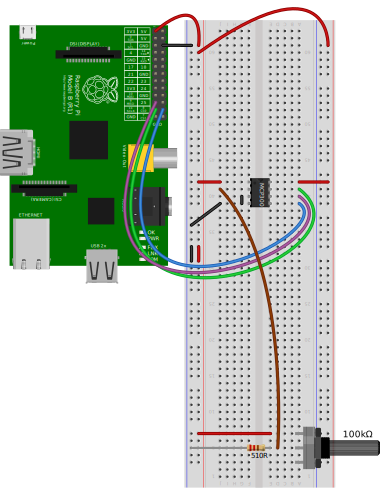

# About TLC1549

[TOC]

## Memo

用变阻器试一下。

## 记录

电路[Fritzing文件](fritzing/02-tlc-slider.fzz)：



代码[loop_display_tlc1549_value.py]：

```python
import display_tlc1549_value
import time

while True:
    display_tlc1549_value.readValue()
    time.sleep(0.2)
```

**NOTE** 变阻器不能设置成0？

- - -

[loop_display_tlc1549_value.py]: ../workspace/loop_display_tlc1549_value.py
