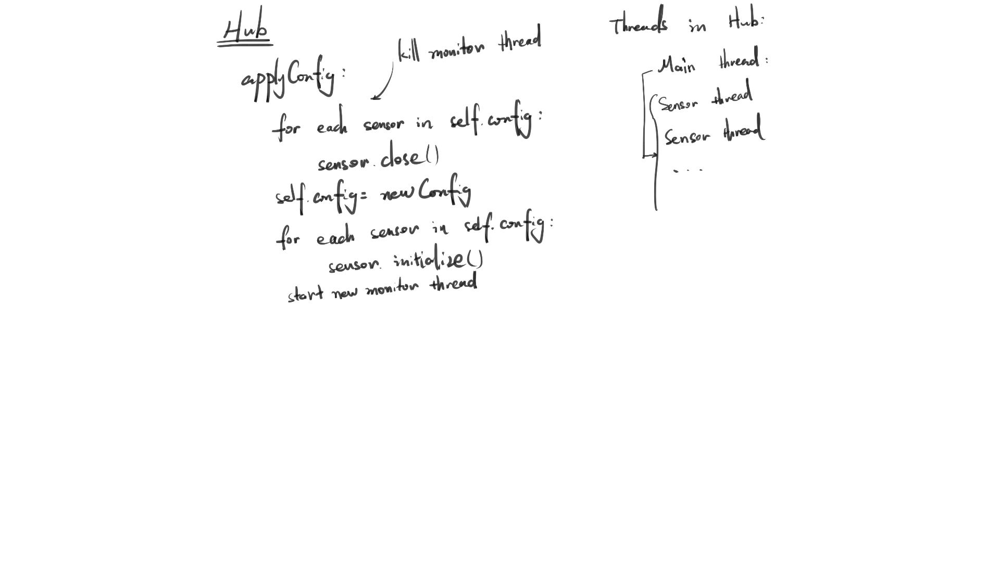
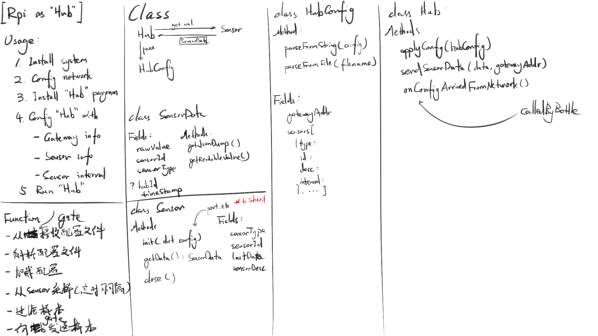
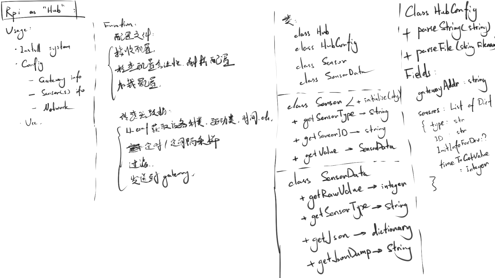

# 文档: Hub模块

[TOC]

## 依赖

* `pycurl`，HTTP请求发送`pip install pycurl`
* `gevent`, HTTP服务器`pip install gevent`
* `bottle`, web框架`pip install bottle`

### 在Windows下安装pycUrl:

http://pycurl.sourceforge.net/doc/install.html#windows

pycurl-7.19.5.win32-py2.7.msi   13-Jul-2014

### 在Windos下安装gevent:

Windows下需要`Microsoft Visual C++ Compiler for Python 2.7`

http://www.microsoft.com/en-us/download/details.aspx?id=44266

## 使用

Hub模块安装在RPi上。

1. 安装RPi系统
2. 配置RPi网络
3. 安装Hub
4. 配置Hub.conf配置文件
5. 运行Hub

## 功能

* 从文件读取配置文件
* 解析配置文件
* 从Gateway接收配置文件
* 定时从Sensor采样
* 过滤样本数据
* 向Gateway发送样本

## HTTP API

Hub的API：

* /hub/config
* /hub/log

Hub可能调用的Gateway的API：

* /gateway/sensordata
* /gateway/log

## 类

* Hub
* HubConfig
* Sensor
* SensorData

## class Hub

Pseudo-code:

threadSensorTuples = [(Thread, Sensor), ...]

```python

def __init__(self):
    self.oldConfig = None
    self.config = None
    self.threadSensorTuples = None

def applyConfig(self, hubConfig):
    self.oldConfig = self.config
    
    self.reset()
    
    self.config = hubConfig
    
    for sensorConfig in self.config.sensors:
        sensor = create_sensor_from_config(sensorConfig)
        thread = Thread.Timer(...)
        self.threadSensorTuples.add((thread, sensor))
    
    try:
        sensor.initialize()
        thread.start()
    except Exception as e:
        self.reset()
        self.config = self.oldConfig
        self.oldConfig = None
        self.applyConfig(self, self.oldConfig)

def reset(self):
    """
    clear config and stop all monitor threads
    """
    for (thread, sensor) in self.threadSensorTuples:
        thread.stop()
        sensor.close()
    
    self.threadSensorTuples = []
    self.config = None
    

def getAndSendSensorData(self, sensor):
    toBeSend = sensor.getJsonDumpData()
    send_http_post("http://gateway:port/sensordata", toBeSend)

```

## class HubServer

Pseudo-code:

```python
@url("/config")
def config(self):
    newConfig = getConfigFromHttpPost()
    self.Hub.applyConfig(newConfig)
```

## 记录






